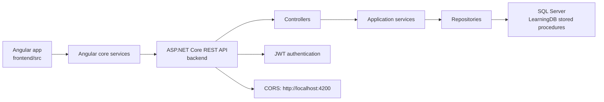
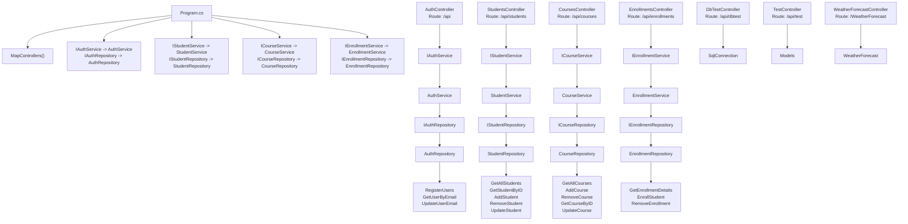
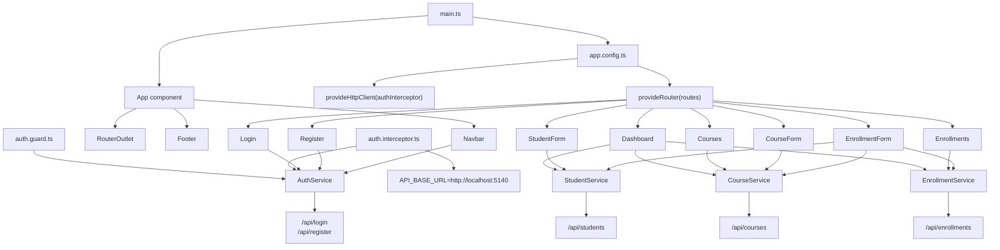

# LearningApi Project Graph

Generated: 2026-04-24

This document is the reusable project map. Read this before doing broad codebase work so the project does not need to be rediscovered from the filesystem each time. The machine-readable cache lives at `.codex/project-graph.json`.

## Scope

Included:
- Backend source and configuration under `backend/`
- Frontend source and configuration under `frontend/src`, `frontend/public`, and root Angular config files

Excluded as generated or third-party noise:
- `backend/bin`
- `backend/obj`
- `frontend/node_modules`
- `frontend/.angular/cache`
- `frontend/dist`

## System Overview

## Runtime Roots

| Area | Path | Purpose |
| --- | --- | --- |
| Backend | `backend/LearningApi.csproj` | ASP.NET Core Web API targeting `net10.0` |
| Backend entry | `backend/Program.cs` | DI, CORS, JWT auth, controller mapping |
| Frontend | `frontend/package.json` | Angular 21 app |
| Frontend entry | `frontend/src/main.ts` | Bootstraps Angular |
| Frontend config | `frontend/src/app/app.config.ts` | Router and HTTP interceptor setup |
| Frontend routes | `frontend/src/app/app.routes.ts` | Page route graph |

## Backend Graph

### Backend Dependencies

| Package | Version | Used for |
| --- | --- | --- |
| `BCrypt.Net-Next` | `4.1.0` | Password hashing |
| `Microsoft.AspNetCore.Authentication.JwtBearer` | `10.0.7` | JWT bearer authentication |
| `Microsoft.AspNetCore.OpenApi` | `10.0.7` | OpenAPI support |
| `Microsoft.Data.SqlClient` | `7.0.0` | SQL Server access |

### Backend API Surface

| Controller | Base route | Endpoints |
| --- | --- | --- |
| `AuthController` | `/api` | `POST /register`, `POST /login`, `PUT /update-email` |
| `StudentsController` | `/api/students` | `GET /`, `GET /{id}`, `POST /`, `DELETE /{id}`, `GET /me`, `PUT /{id}` |
| `CoursesController` | `/api/courses` | `GET /`, `POST /`, `DELETE /{id}`, `GET /{id}`, `PUT /{id}` |
| `EnrollmentsController` | `/api/enrollments` | `GET /`, `POST /`, `DELETE /{id}` |
| `DbTestController` | `/api/dbtest` | `GET /` |
| `TestController` | `/api/test` | `POST /student`, `GET /student`, `GET /student/{id}`, `GET /students`, `GET /search`, `GET /students-filter` |
| `WeatherForecastController` | `/WeatherForecast` | `GET /` |

### Backend File Groups

| Group | Files |
| --- | --- |
| Controllers | `AuthController.cs`, `CourseController.cs`, `DbTestController.cs`, `EnrollmentsController.cs`, `StudentsController.cs`, `TestController.cs`, `WeatherForecastController.cs` |
| Services | `AuthService.cs`, `CourseService.cs`, `EnrollmentService.cs`, `StudentService.cs` plus matching `I*Service.cs` interfaces |
| Repositories | `AuthRepository.cs`, `CourseRepository.cs`, `EnrollmentRepository.cs`, `StudentRepository.cs` plus matching `I*Repository.cs` interfaces |
| Models | `Course.cs`, `Enrollment.cs`, `Student.cs`, `User.cs`, `WeatherForecast.cs` |
| DTOs | `CourseCreateDto.cs`, `CourseUpdateDto.cs`, `EnrollmentCreateDto.cs`, `StudentCreateDto.cs`, `StudentUpdateDto.cs` |

## Frontend Graph

### Frontend Routes

| Route | Component | Guard |
| --- | --- | --- |
| `/` | Redirects to `/login` | No |
| `/login` | `Login` | No |
| `/register` | `Register` | No |
| `/dashboard` | `Dashboard` | `authGuard` |
| `/dashboard/add` | `StudentForm` | `authGuard` |
| `/dashboard/edit/:id` | `StudentForm` | `authGuard` |
| `/dashboard/courses` | `Courses` | `authGuard` |
| `/dashboard/courses/add` | `CourseForm` | `authGuard` |
| `/dashboard/courses/edit/:id` | `CourseForm` | `authGuard` |
| `/dashboard/enrollments` | `Enrollments` | `authGuard` |
| `/dashboard/enrollments/add` | `EnrollmentForm` | `authGuard` |
| `/**` | Redirects to `/login` | No |

### Frontend Service To Backend Mapping

| Angular service | Backend route | Operations |
| --- | --- | --- |
| `AuthService` | `/api/login`, `/api/register` | Login, register, token persistence |
| `StudentService` | `/api/students` | List, get by id, create, update, delete |
| `CourseService` | `/api/courses` | List, get by id, create, update, delete |
| `EnrollmentService` | `/api/enrollments` | List, create, delete |

### Frontend File Groups

| Group | Files |
| --- | --- |
| App shell | `app.ts`, `app.html`, `app.css`, `app.config.ts`, `app.routes.ts` |
| Core config | `core/api.config.ts` |
| Core auth | `core/guards/auth.guard.ts`, `core/interceptors/auth.interceptor.ts`, `core/services/auth.service.ts` |
| Core models | `course.ts`, `enrollment.ts`, `student.ts`, `user.ts` |
| Core services | `course.service.ts`, `enrollment.service.ts`, `student.service.ts` |
| Pages | `course-form`, `courses`, `dashboard`, `enrollment-form`, `enrollments`, `login`, `register`, `student-form` |
| Shared UI | `shared/navbar`, `shared/footer` |
| Global styles | `src/styles.css`, `src/styles/base.css`, `src/styles/components.css`, `src/styles/layout.css`, `src/styles/tokens.css` |

## Change Navigation

Use this map to avoid repeated broad parsing:
- API contract changes usually touch one backend controller, its service/interface, repository/interface, model or DTO, and the matching Angular `core/services/*` file.
- Student feature changes start at `StudentsController`, `StudentService`, `StudentRepository`, `student.service.ts`, `student.ts`, `dashboard`, and `student-form`.
- Course feature changes start at `CoursesController`, `CourseService`, `CourseRepository`, `course.service.ts`, `course.ts`, `courses`, and `course-form`.
- Enrollment feature changes start at `EnrollmentsController`, `EnrollmentService`, `EnrollmentRepository`, `enrollment.service.ts`, `enrollment.ts`, `enrollments`, and `enrollment-form`.
- Auth changes start at `AuthController`, `AuthService`, `AuthRepository`, `auth.service.ts`, `auth.guard.ts`, `auth.interceptor.ts`, `login`, `register`, and `navbar`.
